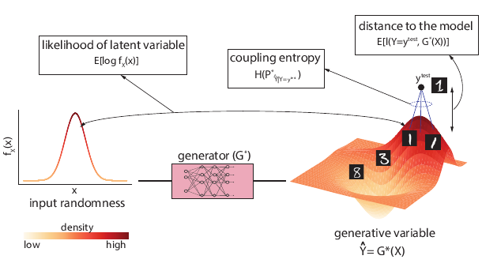
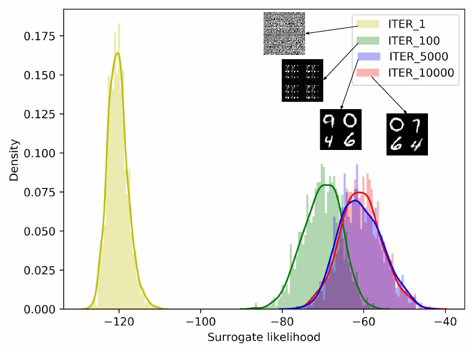
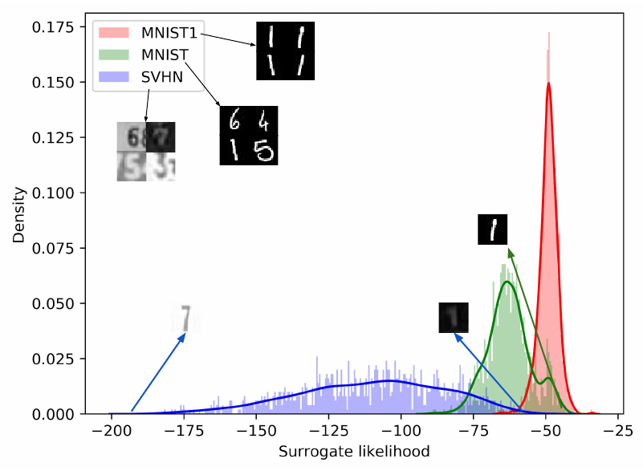

# EntropicGANs_meet_VAEs
Official implementation of "EntropicGANs meet VAEs: A Statistical Approach to Compute Sample Likelihoods in GANs"

<p align="center">
  
</p>

## Training 
To train the model, run
```
python src/main.py --savename mnist --savedir results/MNIST --gan_mode swgan --usePrimalLoss
```

To compute sample likelihoods on the trained EntropicGAN model, run
```
python src/main.py --savename mnist --savedir results/MNIST --loadpath results/MNIST/models/model_5000.ckpt --gan_mode swgan --mode eval --evalroot 'path to dataset whose likelihood we wish to compute'
```

The likelihood scores for samples are stored as a numpy array.

<p align="center">
  
</p>

<p align="center">
  
</p>

## Citation

If you use this code for your research, please cite

    @InProceedings{pmlr-v97-balaji19a,
      title = 	 {Entropic {GAN}s meet {VAE}s: A Statistical Approach to Compute Sample Likelihoods in {GAN}s},
      author = 	 {Balaji, Yogesh and Hassani, Hamed and Chellappa, Rama and Feizi, Soheil},
      booktitle = 	 {Proceedings of the 36th International Conference on Machine Learning},
      pages = 	 {414--423},
      year = 	 {2019},
      editor = 	 {Chaudhuri, Kamalika and Salakhutdinov, Ruslan},
      volume = 	 {97},
      series = 	 {Proceedings of Machine Learning Research},
      address = 	 {Long Beach, California, USA},
      month = 	 {09--15 Jun},
      publisher = 	 {PMLR},
      pdf = 	 {http://proceedings.mlr.press/v97/balaji19a/balaji19a.pdf},
      url = 	 {http://proceedings.mlr.press/v97/balaji19a.html}
    }


